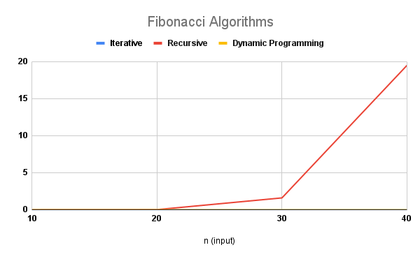

[](https://classroom.github.com/a/kdfTwECC)
# Midterm p1: Report on Analysis of Fibonacci  Series
* **Author**: Karina Quenta
* **GitHub Repo**: https://github.com/CS5008Fall2025/midterm-report-karinaquenta
* **Semester**: Fall 2025
* **Languages Used**: C, Java

## Overview
The Fibonacci algorithm is about finding numbers where every number is the sum of the two numbers before it (after the first two). I keep adding the previous two numbers to continuouly get the next two numbers. There are three common ways to solve a Fibonacci algorithm: iteratively, recursively, and by dynamic programming. Each method solves the same problem in different ways and has helped me understand different ways to solve a Fibonacci algorithm.

Big O Analysis and Pseudocode: When analyzing the performance of the different type of approaches, understanding why each version runs faster than another is an important factor. I explained the reasoning below for all three approaches.

Iterative Approach: The idea here is to use a simple for loop to calculate each Fibonacci number one at a time. I started with two variables 'prev1 = 0' and 'prev2 = 1' and then built the rest of the series by adding the previous two numbers. Each loop iteration performs only one addition and two assignments, which means the work grows linearly with the input size. The recurrence for this is 'T(n) = T(n-1) + O(1)', which solves to O(n) time. Since I’m only storing a few integers, the space complexity stays at O(1). This method is efficient and beginner-friendly because I can clearly see how each Fibonacci number is formed step by step.

Psuedocode:
```c
function fib_iterative(n):
    if n == 0: return 0
    if n == 1: return 1
    prev1 = 0
    prev2 = 1
    for i from 2 to n:
        current = prev1 + prev2
        prev1 = prev2
        prev2 = current
    return prev2

```
Recursive Approach: The idea with recursive appraoch uses the mathematical approach by having the function calls itself twice. Once for 'fib(n-1)' and once for 'fib(n-2)' until it reaches the base cases 'n == 0' or 'n == 1'. This creates a branching recursion tree that expands quickly because the same subproblems are solved multiple times. The recurrence is T(n) = T(n-1) + T(n-2) + O(1), and when I visualize that tree, the number of calls roughly doubles at each level. That’s why the time complexity is O(2ⁿ). The space complexity is O(n) because of the recursive call stack. Although it’s not efficient, it helped me understand how recursion expands.

Psuedocode:
```c
function fib_recursive(n):
    if n == 0: return 0
    if n == 1: return 1
    return fib_recursive(n-1) + fib_recursive(n-2)

```

Dynamic Programming approach: For the dynamic programming approach, I used tabulation to store all previously computed Fibonacci values in an array. This makes it more efficient and prevents redundancy because every new value only depends on two earlier ones that I’ve already saved. I start with 'fib[0] = 0' and 'fib[1] = 1', then loop from index 2 up to n, filling in each new entry with 'fib[i] = fib[i-1] + fib[i-2]'. Since I fill the array once and each loop step does constant work, the total time complexity is O(n). Storing the array takes O(n) space, though it could be optimized to O(1) if I only keep track of the last two numbers. I like this method because it’s fast, organized, and easy to reason about.

Psuedocode:
```c
function fib_dynamic(n):
    if n == 0: return 0
    if n == 1: return 1
    fib = new array of size n+1
    fib[0] = 0
    fib[1] = 1
    for i from 2 to n:
        fib[i] = fib[i-1] + fib[i-2]
    return fib[n]

```

## Empirical Data & Discussion 
When I actually ran my Fibonacci code, I got some really interesting results that matched what I expected from my Big-O analysis. Seeing the timing differences in real life made it click for me even more.

So here’s what I noticed:

- The iterative version ran super fast, basically instant for small inputs. Even when I went up to something like n = 40 or n = 50, it still finished quickly because it only loops once through all the numbers.

- The recursive version got slow really fast! For small values like n = 10 or n = 15, it was fine, but by n = 35 it already took several seconds. That matches my Big-O analysis because recursion doubles the work each time.

- The dynamic programming approach ran almost as fast as the iterative one. It filled the array efficiently, and the only small difference was the space used to store values. Time-wise, it behaved just like O(n), exactly like my prediction.

What could affect my runtime?

Even though my results matched my assumptions, I learned that timings can be affected by real life circumstances. Some factors that affected my results are:

-  Since I am running this on my own laptop, and background programs or tabs can slow things down a little.

- I used 'System.nanoTime()' to measure runtime, which is pretty accurate, but still has some small variations every time I run it.

- The smaller the n, I noticed the less noticeable the differences are between the methods. For bigger n, the gap gets a lot bigger (especially for recursion).




## Language Analysis
I decided to use Java as my second language because I wanted to see how a higher-level, object-oriented language compares to C when solving the same problem. After writing the Fibonacci program in C, I felt like I understood how things worked at a very low level working with memory manually, thinking about arrays, and making sure I freed space correctly. But I also wanted to experience what it feels like to write the same algorithm in a language that helps you a little more.

Java let me focus more on the structure and logic of my algorithm instead of worrying about memory management or pointers. I also wanted to test features like 'System.nanoTime()' for measuring runtime, 'DecimalFormat' for clearner looking output, and how recursion behaves with a managed call stack. By comparing both languages, I got to see how C makes me think about what’s happening inside the computer, while Java lets me think more about the algorithm itself. That helped me understand not just how to code Fibonacci but how different languages shape how I think about solving them.

### Language 1: C
When I first wrote my Fibonacci program in C, I had to think very differently. C gives me more control, but that also means you have to handle everything myself like the memory, variable types, and even printing spaces correctly. At first, my biggest concern was making sure the program didn’t crash or leak memory, especially when I used arrays for the dynamic programming version. I also had to pay attention to how integers behave and how to format my print statements just right. Writing loops felt familiar, but recursion in C required me to think carefully to create my base cases and the function’s return types. What I focused on most was debugging logic errors, adding clear print statements, and properly working with malloc and manage freeing memory properly. Even though it was challenging, I loved how C made me think about what was happening in the background and making sure my program actually run.


### Language 2: Java
Java feels more structured, and it automatically manages memory, which gave me some relief after wrestling with pointers in C. I was curious to see how Java’s built-in libraries, like System.nanoTime() for timing and DecimalFormat for formatting output, could help me organize my results better. What I really liked was how clean it felt to separate methods for each approach (iterative, recursive, and dynamic programming) inside one class. I also noticed that Java programs take a bit longer to start running compared to C because of the JVM (Java Virtual Machine), but once it starts, the timing results made perfect sense. My main concern was understanding how Java handles integers and recursion depth since stack overflow can happen if I push it too far. Overall, I found that Java helped me focus more on algorithm design instead of worrying about memory, which made it easier to experiment and compare data.


### Comparison and Discussion Between Experiences
Working with both C and Java on the same Fibonacci algorithms honestly felt like switching between two different worlds. In C, I had to think carefully about every step like the memory, variable types, and even how I printed things to make the output look clean. I was constantly aware that one small mistake, like forgetting to free memory or using the wrong type, could crash the whole program. On the other hand, Java felt more forgiving and organized. I could focus on the structure of my code, break it into clean methods, and use helpful built-in tools for timing and formatting. I didn’t have to worry about pointers or memory leaks, which made the process smoother and a little less intimidating.

When I compared my data, the timing results matched what I expected but also showed some clear language differences. My C version ran a bit faster for small inputs because it’s compiled directly into machine code. Java was slightly slower to start because of the JVM (Java Virtual Machine), but once running, the differences became tiny for the iterative and dynamic approaches. The recursive version was slow in both, but I noticed Java handled the stack a little differently becasue I hit the recursion limit faster in Java, while my C version let me push it a little further.

## Conclusions / Reflection
Working on this Fibonacci project in both C and Java taught me way more than I expected. Using two different languages for the same algorithm made me appreciate both sides of programming and pushed me to think differently when working on this midterm assignment. When I first started, I thought Fibonacci was just a simple math pattern, but as I went deeper into the iterative, recursive, and dynamic programming approaches, I began to really understand how small design choices, like whether to use a loop or recursion, can completely change how fast a program runs.

In C, I learned to slow down and think carefully about every detail. I had to manage memory, handle arrays, and test everything step by step. It was a little intimidating at first, but it forced me to build good habits like freeing memory, and keeping my code clean. Then switching to Java gave me the space to breathe a bit. I could focus more on the algorithm itself instead of worrying about the setup. I learned how object-oriented design helps me organize my work and how its built in features make testing and analysis feel more professional.

The biggest takeaway for me is that every language teaches a different mindset. C trained my precision in coding and Java trained my structure. This project reminded me that learning to code isn’t just about getting things to compile — it’s about developing curiosity, patience, and confidence. And that’s the real win for me.


## References
1. Programiz. C Program to Display Fibonacci Sequence Using Loops and Recursion. Available at: https://www.programiz.com/c-programming/examples/fibonacci-series. Accessed: October 2025.
2. GeeksforGeeks. Fibonacci Series in C, C++, Java and Python. Available at: https://www.geeksforgeeks.org/program-for-fibonacci-numbers/. Accessed: October 2025.
3. TutorialsPoint. Dynamic Programming – Introduction and Examples. Available at: https://www.tutorialspoint.com/dynamic_programming/index.html. Accessed: October 2025.
4. Brian W. Kernighan and Dennis M. Ritchie. 1988. The C Programming Language (2nd ed.). Prentice Hall. [Textbook]
5. Thomas H. Cormen, Charles E. Leiserson, Ronald L. Rivest, and Clifford Stein. 2022. Introduction to Algorithms (4th ed.). MIT Press. (Dynamic programming; Fibonacci.)
6. The Open Group. 2018. The Open Group Base Specifications Issue 7, 2018 Edition (POSIX.1-2017) — <time.h>, clock(), CLOCKS_PER_SEC. The Open Group. Available at: https://pubs.opengroup.org/onlinepubs/9699919799/
7. Free Software Foundation. 2024. The GNU C Library Reference Manual — Memory Allocation (malloc, free). Free Software Foundation. Available at: https://www.gnu.org/software/libc/manual/
8. cppreference contributors. 2025. C library: <stdlib.h> — malloc, free. cppreference. Available at: https://en.cppreference.com/w/c/memory
9. cppreference contributors. 2025. C library: <time.h> — clock, CLOCKS_PER_SEC. cppreference. Available at: https://en.cppreference.com/w/c/chrono
7. Robert Sedgewick and Kevin Wayne. 2011. Algorithms (4th ed.). Addison-Wesley. (Iterative vs. recursive methods; Fibonacci examples.) [Textbook]
